# Dokumentasi Sistem Informasi TK Orchid

Folder ini berisi dokumentasi analisis & perancangan sistem: **kamus data**, **ERD**, **LRS**, seluruh **diagram UML** (use case, activity, sequence, state machine, class, object, package, component, deployment, communication, interaction overview, timing), **DFD**, dan **flowchart**. Semua nama entitas dan atribut memakai **bahasa Indonesia**, sama persis dengan nama tabel & kolom di basis data.

- 📘 [Kamus data (37 tabel)](kamus-data.md)
- 🖼️ Gambar siap pakai: [`diagram/png/`](diagram/png) (untuk dokumen/presentasi) dan [`diagram/svg/`](diagram/svg) (vektor, tetap tajam saat diperbesar)
- ✏️ Sumber diagram (PlantUML): [`diagram/src/`](diagram/src)

## Ringkasan basis data

| Aspek | Keterangan |
| --- | --- |
| DBMS | SQLite (berkas `prisma/dev.db`), diakses lewat Prisma ORM |
| Jumlah tabel | 37 |
| Jumlah relasi (foreign key) | 53 — dijaga langsung oleh database (`PRAGMA foreign_keys = ON`) |
| Integritas | Kunci unik mencegah data ganda, mis. presensi unik per `(id_siswa, tanggal)`, penempatan kelas unik per `(id_siswa, id_tahun_ajaran)`, penilaian unik per `(id_siswa, id_tahun_ajaran, periode, id_domain)` |
| Aturan hapus | `Cascade` (data anak ikut terhapus, mis. `detail_tagihan`), `Restrict` (ditolak bila masih dipakai, mis. `jenis_biaya` yang sudah ditagihkan), `SetNull` (rujukan dikosongkan) — rincian per relasi ada di kamus data |
| Uang | Bilangan bulat rupiah (tanpa pecahan) |
| Waktu | `dibuat_pada` otomatis saat data dibuat, `diperbarui_pada` otomatis saat diubah |

### Keamanan data

- Kata sandi disimpan sebagai hash **bcrypt**, tidak pernah dalam bentuk asli.
- Sesi login memakai cookie `httpOnly` yang ditandatangani **HMAC-SHA256** (`AUTH_SECRET`); `secure` aktif di production.
- Hak akses diperiksa **dua lapis**: middleware (`src/proxy.ts`) per area URL, lalu setiap server action memeriksa ulang peran di server.
- Guru hanya bisa mengakses kelas yang ia ampu; orang tua hanya melihat anak yang terhubung dengan akunnya, dan hanya rapor yang sudah terbit.
- Percobaan login dibatasi (rate limit) dan aktivitas penting dicatat di `log_audit`.
- Pembayaran dicatat dalam **transaksi** database: bila salah satu langkah gagal, semuanya dibatalkan.

## Konvensi penamaan

- Tabel & kolom: *snake_case* bahasa Indonesia, mis. `siswa.nama_lengkap`, `tagihan.jatuh_tempo`.
- Kunci primer: `id_<tabel>` (mis. `id_siswa`); kunci tamu memakai nama kunci primer yang dirujuk (mis. `penempatan_kelas.id_siswa`). Kolom pelaku memakai kata kerja, mis. `dibuat_oleh`, `dicatat_oleh`, `diterbitkan_oleh` (→ `pengguna`).
- Nilai status disimpan sebagai kode (mis. `PAID`, `PRESENT`); arti setiap kode dalam bahasa Indonesia tercantum di [kamus data](kamus-data.md).
- Di kode TypeScript, model Prisma tetap bernama bahasa Inggris dan dipetakan ke nama Indonesia lewat `@@map` / `@map` di `prisma/schema.prisma`:

<details>
<summary>Tabel padanan model Prisma ↔ tabel database</summary>

| Model Prisma (kode) | Tabel database |
| --- | --- |
| `User` | `pengguna` |
| `Guardian` | `wali` |
| `Teacher` | `guru` |
| `AcademicYear` | `tahun_ajaran` |
| `Student` | `siswa` |
| `StudentGuardian` | `siswa_wali` |
| `Class` | `kelas` |
| `Enrollment` | `penempatan_kelas` |
| `AdmissionPeriod` | `periode_ppdb` |
| `Admission` | `pendaftaran_ppdb` |
| `AdmissionDocument` | `dokumen_pendaftaran` |
| `AssessmentDomain` | `domain_penilaian` |
| `AssessmentScale` | `skala_penilaian` |
| `Assessment` | `penilaian` |
| `DevelopmentReport` | `laporan_perkembangan` |
| `DevelopmentItem` | `detail_laporan` |
| `Attendance` | `presensi` |
| `Schedule` | `jadwal` |
| `Activity` | `kegiatan` |
| `ActivityMedia` | `media_kegiatan` |
| `Announcement` | `pengumuman` |
| `AnnouncementRead` | `pengumuman_dibaca` |
| `FeeType` | `jenis_biaya` |
| `Invoice` | `tagihan` |
| `InvoiceItem` | `detail_tagihan` |
| `Payment` | `pembayaran` |
| `PaymentAllocation` | `alokasi_pembayaran` |
| `Expense` | `pengeluaran` |
| `StudentDocument` | `dokumen_siswa` |
| `AuditLog` | `log_audit` |
| `PasswordResetToken` | `token_reset_sandi` |
| `SiteSetting` | `pengaturan_situs` |
| `HeroSlide` | `slide_beranda` |
| `GalleryItem` | `galeri` |
| `Facility` | `fasilitas` |
| `Testimonial` | `testimoni` |
| `Faq` | `tanya_jawab` |

</details>

## Daftar diagram

### 1. Entity Relationship Diagram (ERD)

ERD per modul lebih mudah dibaca untuk laporan; entitas abu-abu adalah entitas dari modul lain yang hanya ditampilkan kuncinya.

#### ERD konseptual — notasi Chen (entitas inti)

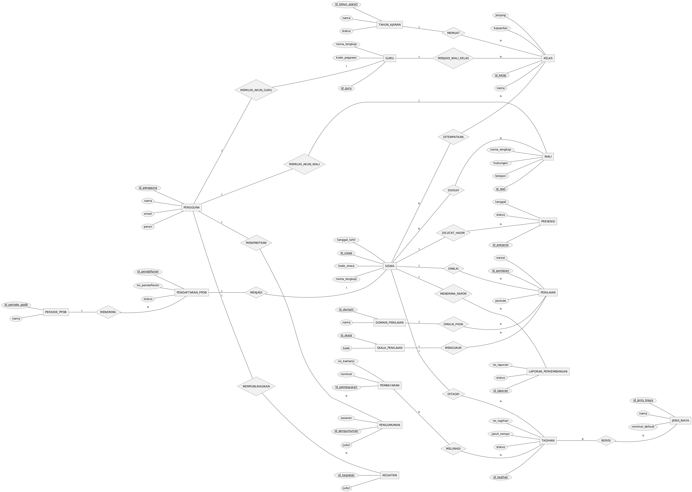

<sub>Sumber: [`diagram/src/erd-konseptual.puml`](diagram/src/erd-konseptual.puml) · Vektor: [`diagram/svg/erd-konseptual.svg`](diagram/svg/erd-konseptual.svg)</sub>

#### ERD lengkap — notasi crow's foot (37 tabel)

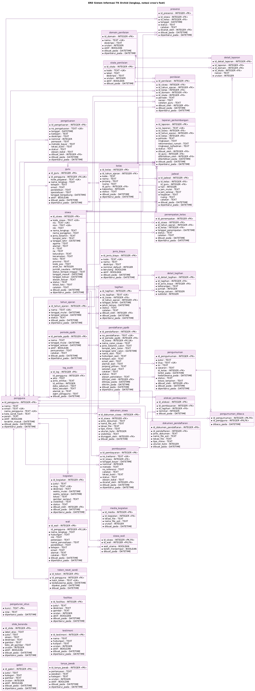

<sub>Sumber: [`diagram/src/erd-lengkap.puml`](diagram/src/erd-lengkap.puml) · Vektor: [`diagram/svg/erd-lengkap.svg`](diagram/svg/erd-lengkap.svg)</sub>

#### ERD modul Pengguna & Hak Akses

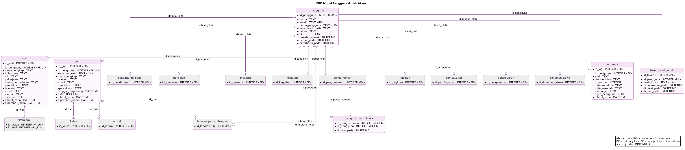

<sub>Sumber: [`diagram/src/erd-pengguna.puml`](diagram/src/erd-pengguna.puml) · Vektor: [`diagram/svg/erd-pengguna.svg`](diagram/svg/erd-pengguna.svg)</sub>

#### ERD modul Kesiswaan & Akademik

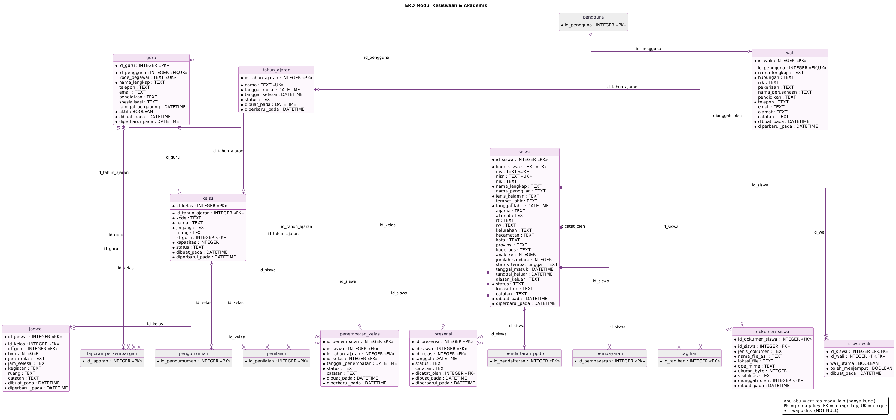

<sub>Sumber: [`diagram/src/erd-akademik.puml`](diagram/src/erd-akademik.puml) · Vektor: [`diagram/svg/erd-akademik.svg`](diagram/svg/erd-akademik.svg)</sub>

#### ERD modul PPDB

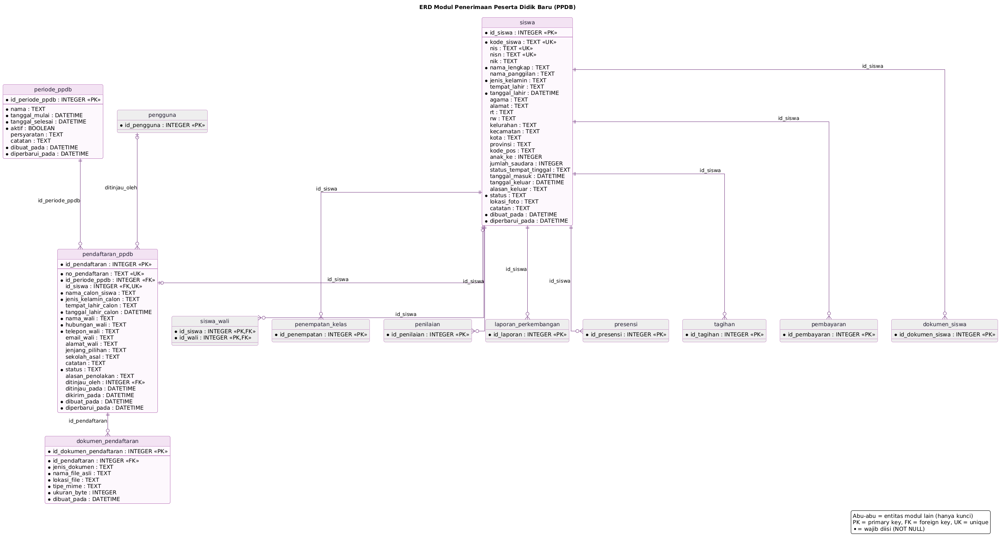

<sub>Sumber: [`diagram/src/erd-ppdb.puml`](diagram/src/erd-ppdb.puml) · Vektor: [`diagram/svg/erd-ppdb.svg`](diagram/svg/erd-ppdb.svg)</sub>

#### ERD modul Penilaian & Laporan Perkembangan

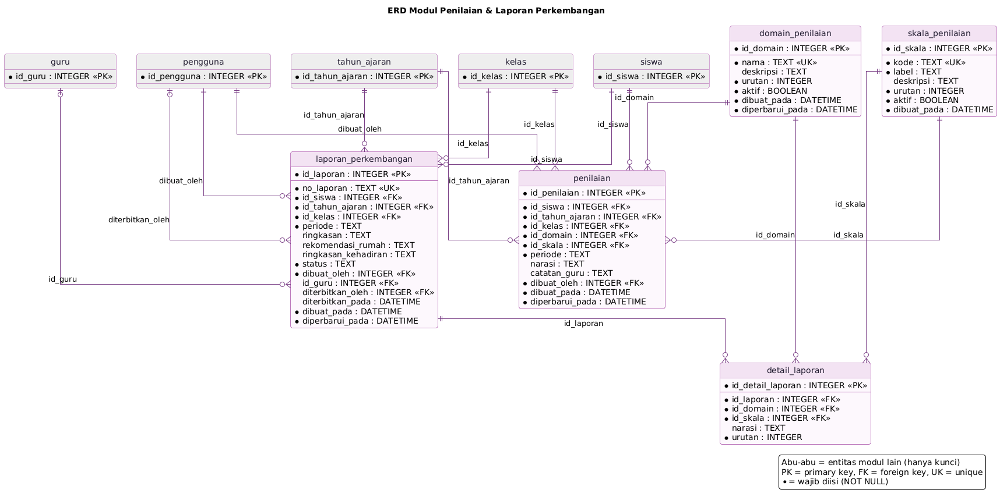

<sub>Sumber: [`diagram/src/erd-penilaian.puml`](diagram/src/erd-penilaian.puml) · Vektor: [`diagram/svg/erd-penilaian.svg`](diagram/svg/erd-penilaian.svg)</sub>

#### ERD modul Keuangan

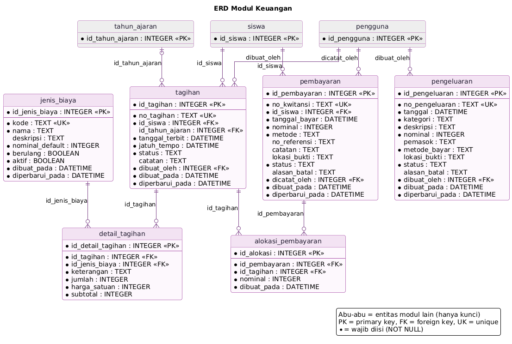

<sub>Sumber: [`diagram/src/erd-keuangan.puml`](diagram/src/erd-keuangan.puml) · Vektor: [`diagram/svg/erd-keuangan.svg`](diagram/svg/erd-keuangan.svg)</sub>

#### ERD modul Informasi & Konten Website

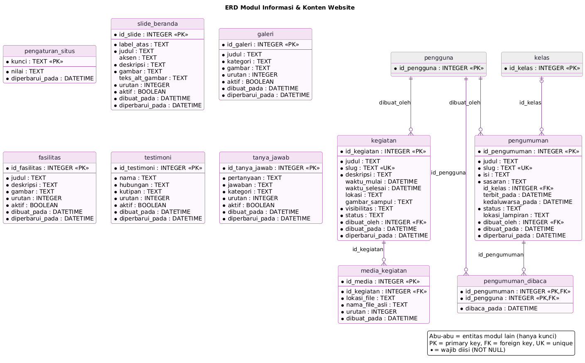

<sub>Sumber: [`diagram/src/erd-informasi.puml`](diagram/src/erd-informasi.puml) · Vektor: [`diagram/svg/erd-informasi.svg`](diagram/svg/erd-informasi.svg)</sub>

### 2. Logical Record Structure (LRS)

#### LRS — tabel dengan kunci primer & kunci tamu

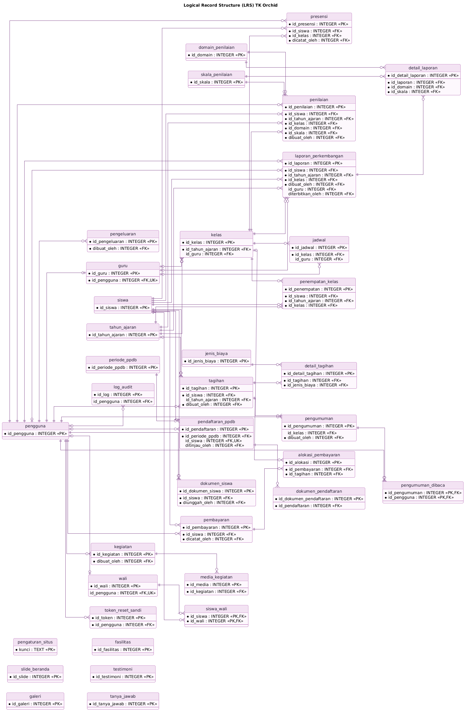

<sub>Sumber: [`diagram/src/lrs.puml`](diagram/src/lrs.puml) · Vektor: [`diagram/svg/lrs.svg`](diagram/svg/lrs.svg)</sub>

### 3. Use Case Diagram

#### Use case keseluruhan sistem

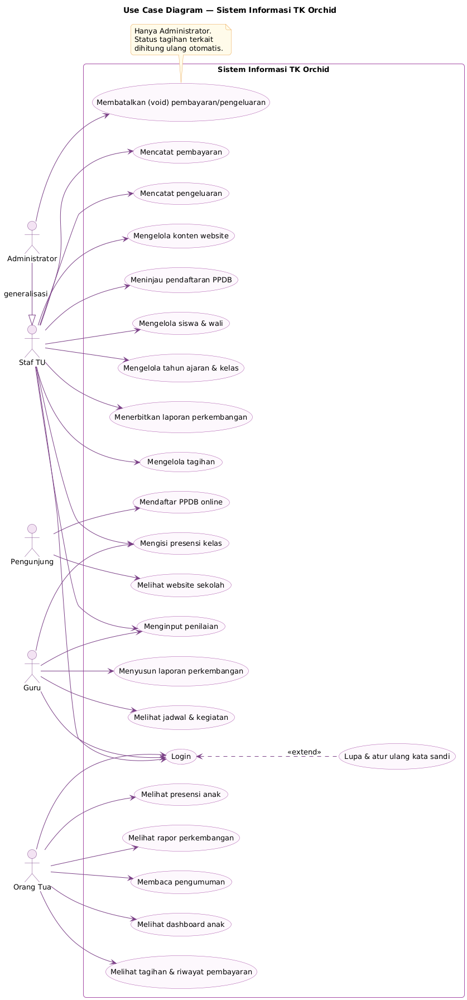

<sub>Sumber: [`diagram/src/uc-sistem.puml`](diagram/src/uc-sistem.puml) · Vektor: [`diagram/svg/uc-sistem.svg`](diagram/svg/uc-sistem.svg)</sub>

#### Use case Administrator & Staf TU

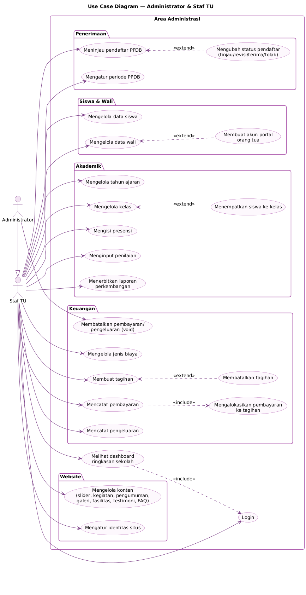

<sub>Sumber: [`diagram/src/uc-admin.puml`](diagram/src/uc-admin.puml) · Vektor: [`diagram/svg/uc-admin.svg`](diagram/svg/uc-admin.svg)</sub>

#### Use case Guru

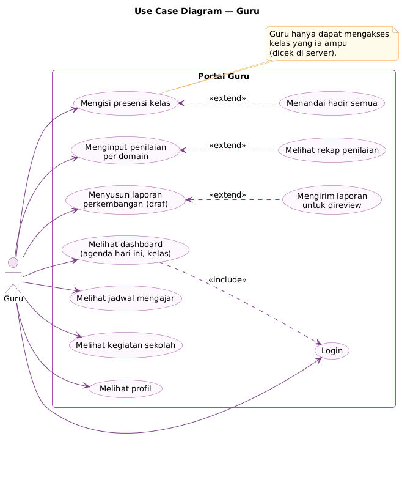

<sub>Sumber: [`diagram/src/uc-guru.puml`](diagram/src/uc-guru.puml) · Vektor: [`diagram/svg/uc-guru.svg`](diagram/svg/uc-guru.svg)</sub>

#### Use case Orang Tua

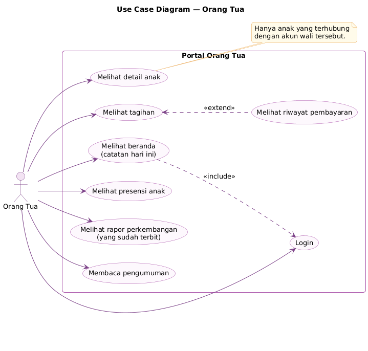

<sub>Sumber: [`diagram/src/uc-orangtua.puml`](diagram/src/uc-orangtua.puml) · Vektor: [`diagram/svg/uc-orangtua.svg`](diagram/svg/uc-orangtua.svg)</sub>

#### Use case Pengunjung website

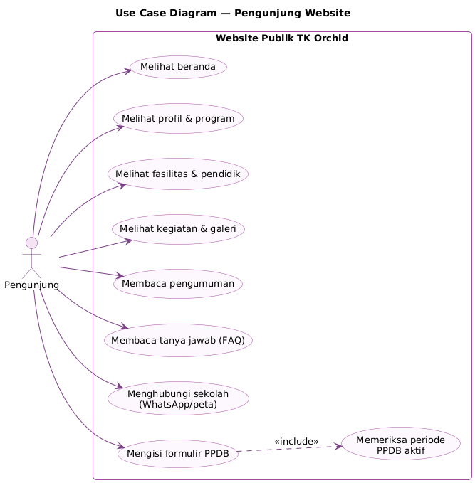

<sub>Sumber: [`diagram/src/uc-pengunjung.puml`](diagram/src/uc-pengunjung.puml) · Vektor: [`diagram/svg/uc-pengunjung.svg`](diagram/svg/uc-pengunjung.svg)</sub>

### 4. Activity Diagram

#### Login & lupa kata sandi

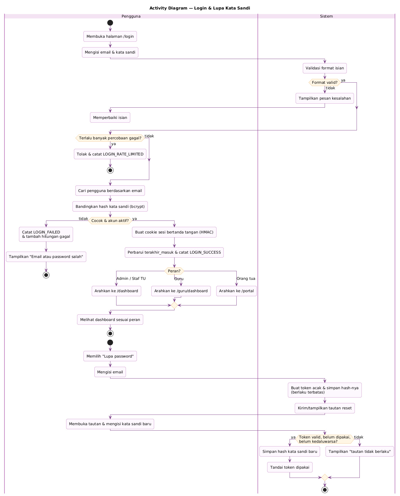

<sub>Sumber: [`diagram/src/act-login.puml`](diagram/src/act-login.puml) · Vektor: [`diagram/svg/act-login.svg`](diagram/svg/act-login.svg)</sub>

#### Pendaftaran PPDB online

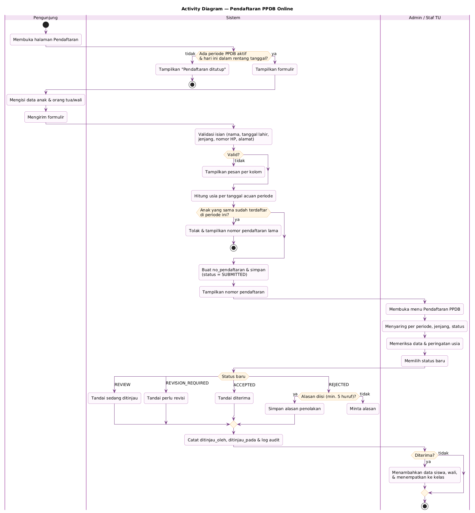

<sub>Sumber: [`diagram/src/act-ppdb.puml`](diagram/src/act-ppdb.puml) · Vektor: [`diagram/svg/act-ppdb.svg`](diagram/svg/act-ppdb.svg)</sub>

#### Kelola siswa, wali & penempatan kelas

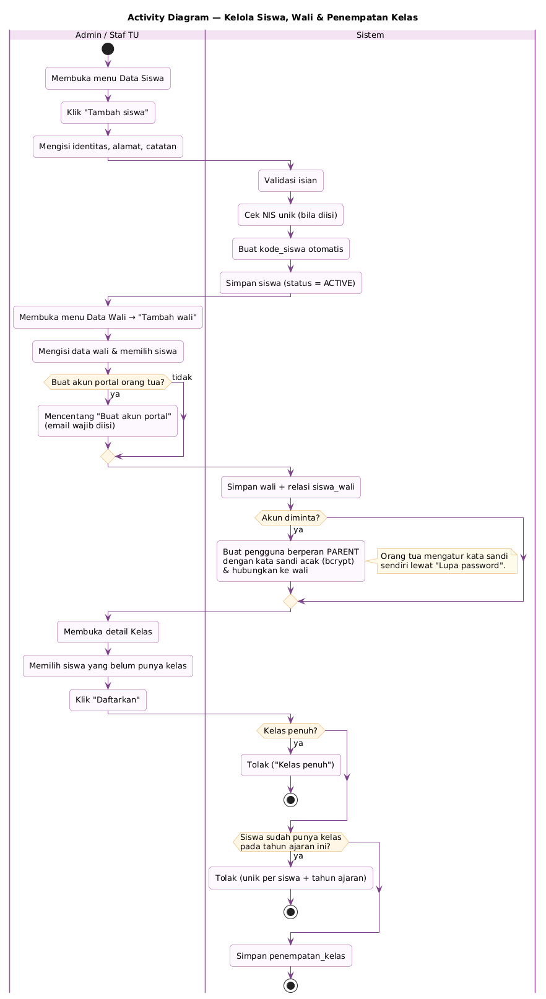

<sub>Sumber: [`diagram/src/act-kelola-siswa.puml`](diagram/src/act-kelola-siswa.puml) · Vektor: [`diagram/svg/act-kelola-siswa.svg`](diagram/svg/act-kelola-siswa.svg)</sub>

#### Pengisian presensi harian

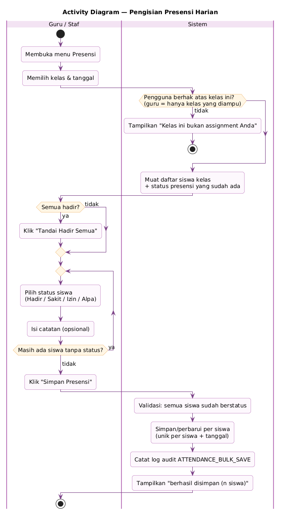

<sub>Sumber: [`diagram/src/act-presensi.puml`](diagram/src/act-presensi.puml) · Vektor: [`diagram/svg/act-presensi.svg`](diagram/svg/act-presensi.svg)</sub>

#### Penilaian & laporan perkembangan

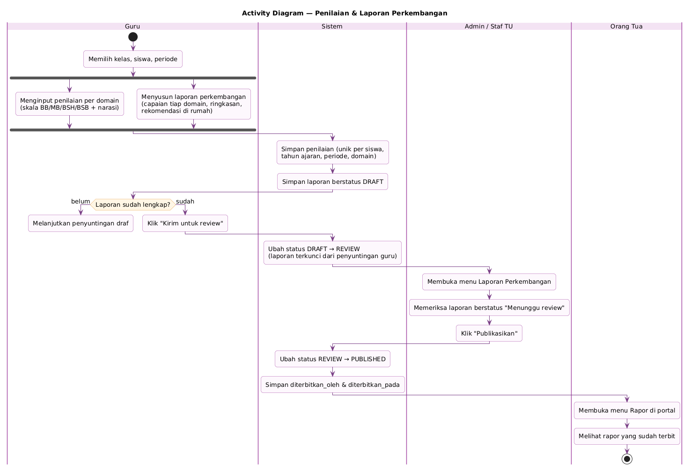

<sub>Sumber: [`diagram/src/act-rapor.puml`](diagram/src/act-rapor.puml) · Vektor: [`diagram/svg/act-rapor.svg`](diagram/svg/act-rapor.svg)</sub>

#### Tagihan & pembayaran

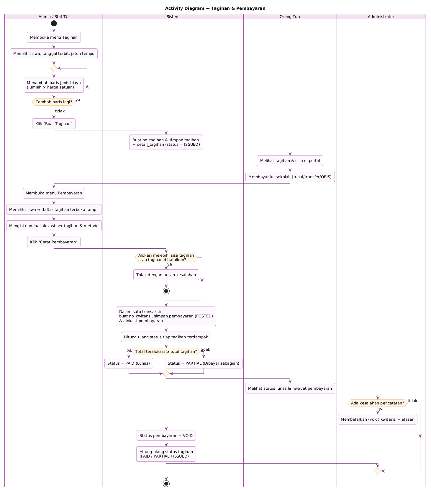

<sub>Sumber: [`diagram/src/act-keuangan.puml`](diagram/src/act-keuangan.puml) · Vektor: [`diagram/svg/act-keuangan.svg`](diagram/svg/act-keuangan.svg)</sub>

#### Kelola konten website

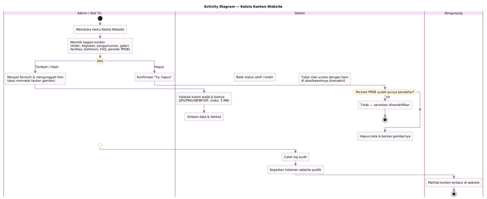

<sub>Sumber: [`diagram/src/act-kelola-website.puml`](diagram/src/act-kelola-website.puml) · Vektor: [`diagram/svg/act-kelola-website.svg`](diagram/svg/act-kelola-website.svg)</sub>

### 5. Sequence Diagram

#### Login

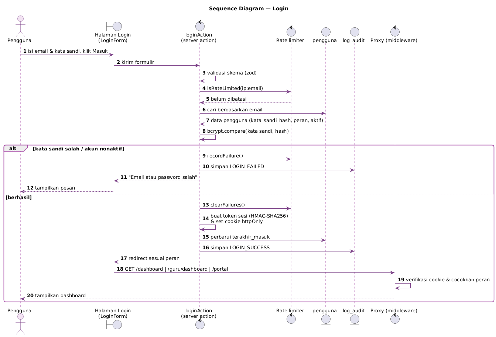

<sub>Sumber: [`diagram/src/seq-login.puml`](diagram/src/seq-login.puml) · Vektor: [`diagram/svg/seq-login.svg`](diagram/svg/seq-login.svg)</sub>

#### Pendaftaran & peninjauan PPDB

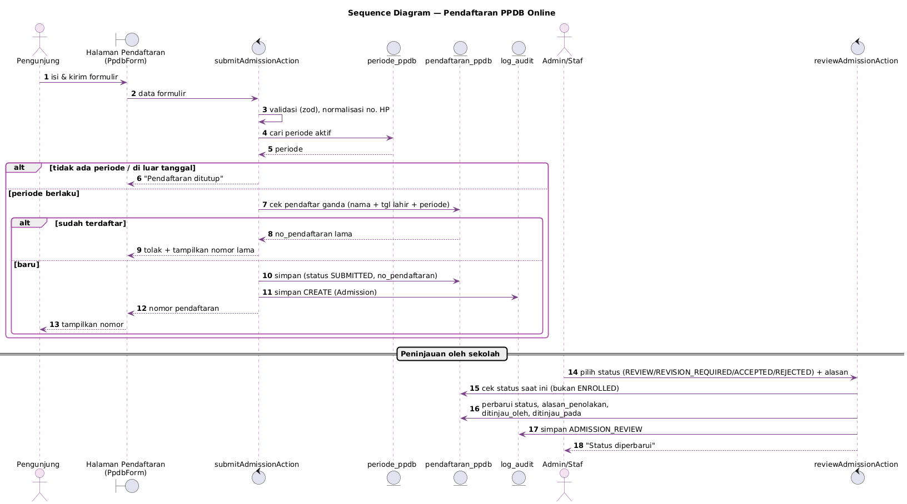

<sub>Sumber: [`diagram/src/seq-ppdb.puml`](diagram/src/seq-ppdb.puml) · Vektor: [`diagram/svg/seq-ppdb.svg`](diagram/svg/seq-ppdb.svg)</sub>

#### Mengisi presensi kelas

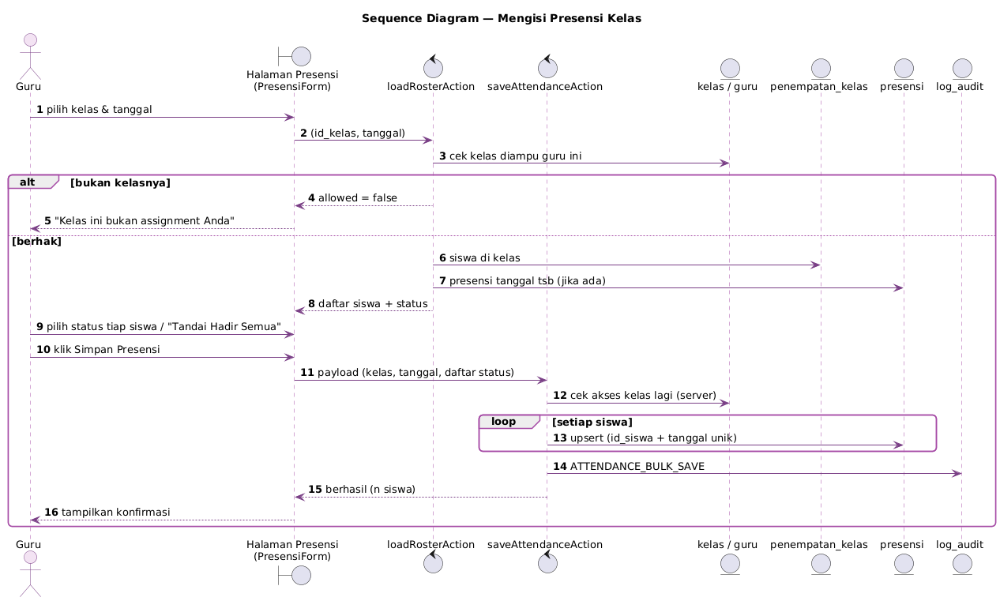

<sub>Sumber: [`diagram/src/seq-presensi.puml`](diagram/src/seq-presensi.puml) · Vektor: [`diagram/svg/seq-presensi.svg`](diagram/svg/seq-presensi.svg)</sub>

#### Mencatat pembayaran

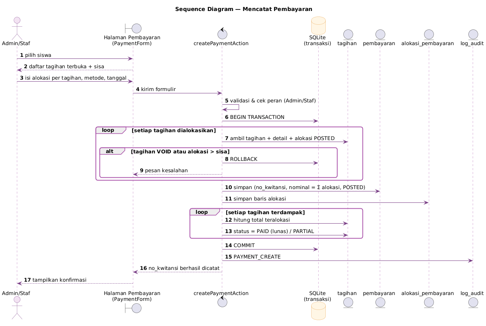

<sub>Sumber: [`diagram/src/seq-pembayaran.puml`](diagram/src/seq-pembayaran.puml) · Vektor: [`diagram/svg/seq-pembayaran.svg`](diagram/svg/seq-pembayaran.svg)</sub>

#### Menyusun & menerbitkan laporan perkembangan

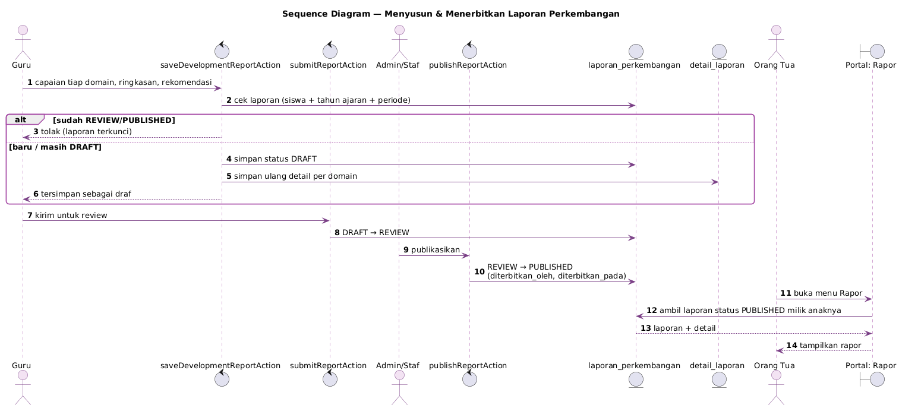

<sub>Sumber: [`diagram/src/seq-rapor.puml`](diagram/src/seq-rapor.puml) · Vektor: [`diagram/svg/seq-rapor.svg`](diagram/svg/seq-rapor.svg)</sub>

#### Orang tua melihat tagihan & riwayat pembayaran

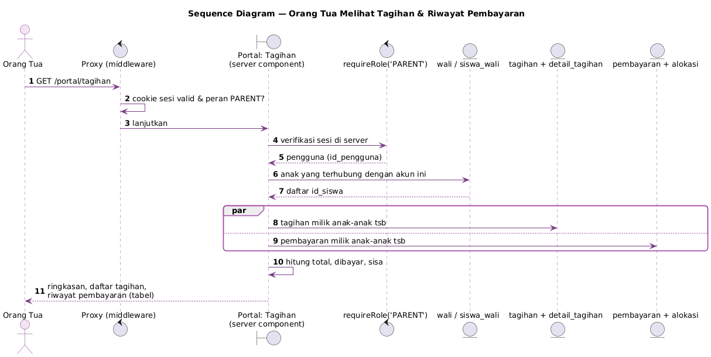

<sub>Sumber: [`diagram/src/seq-ortu-tagihan.puml`](diagram/src/seq-ortu-tagihan.puml) · Vektor: [`diagram/svg/seq-ortu-tagihan.svg`](diagram/svg/seq-ortu-tagihan.svg)</sub>

### 6. State Machine Diagram

#### Status pendaftaran PPDB

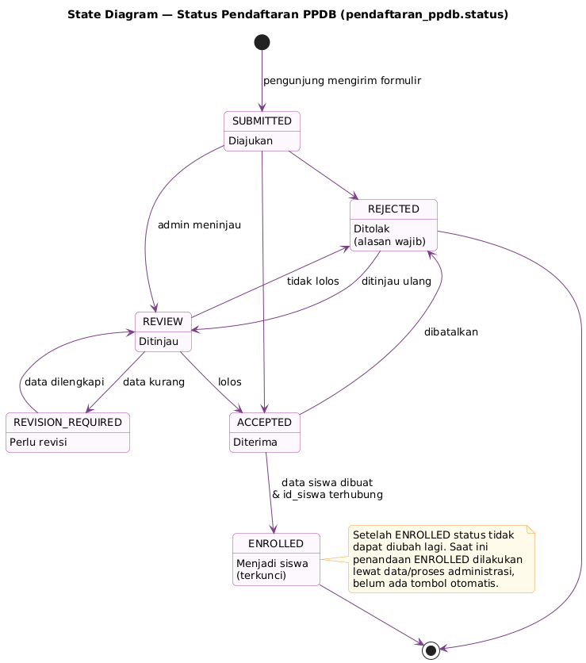

<sub>Sumber: [`diagram/src/state-pendaftaran.puml`](diagram/src/state-pendaftaran.puml) · Vektor: [`diagram/svg/state-pendaftaran.svg`](diagram/svg/state-pendaftaran.svg)</sub>

#### Status tagihan

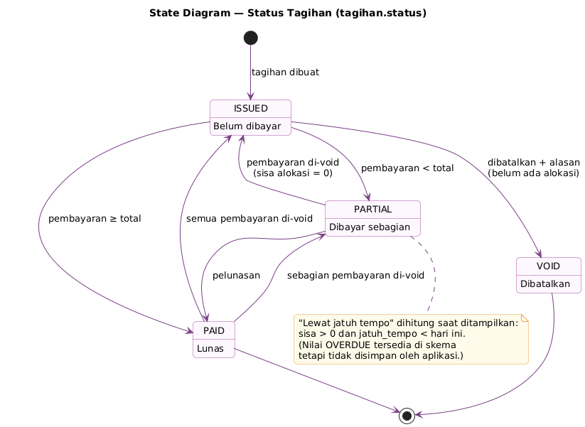

<sub>Sumber: [`diagram/src/state-tagihan.puml`](diagram/src/state-tagihan.puml) · Vektor: [`diagram/svg/state-tagihan.svg`](diagram/svg/state-tagihan.svg)</sub>

#### Status laporan perkembangan

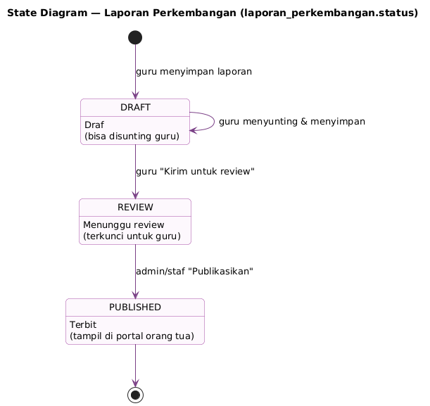

<sub>Sumber: [`diagram/src/state-laporan.puml`](diagram/src/state-laporan.puml) · Vektor: [`diagram/svg/state-laporan.svg`](diagram/svg/state-laporan.svg)</sub>

#### Status siswa

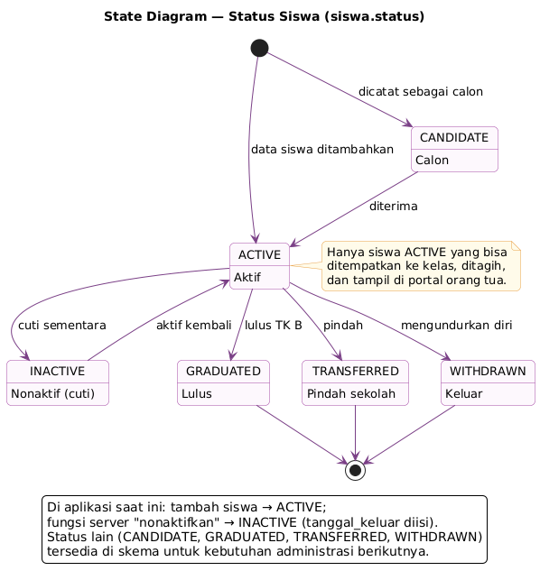

<sub>Sumber: [`diagram/src/state-siswa.puml`](diagram/src/state-siswa.puml) · Vektor: [`diagram/svg/state-siswa.svg`](diagram/svg/state-siswa.svg)</sub>

#### Status konten website & transaksi keuangan

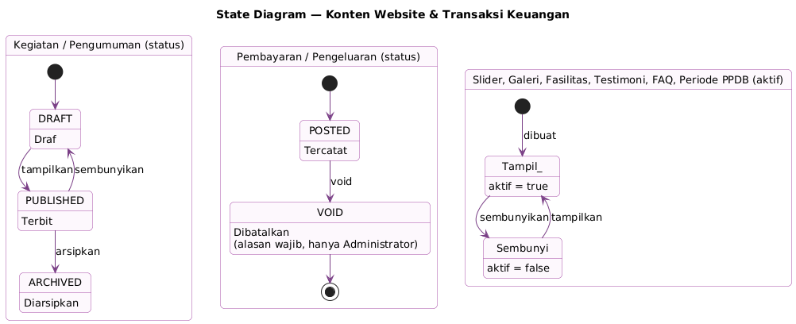

<sub>Sumber: [`diagram/src/state-konten-transaksi.puml`](diagram/src/state-konten-transaksi.puml) · Vektor: [`diagram/svg/state-konten-transaksi.svg`](diagram/svg/state-konten-transaksi.svg)</sub>

### 7. Class Diagram

Atribut diambil dari kolom tabel; operasi mengikuti fitur yang tersedia di aplikasi. Belah ketupat hitam = komposisi (data anak ikut terhapus saat induk dihapus).

#### Class diagram — Pengguna & Hak Akses

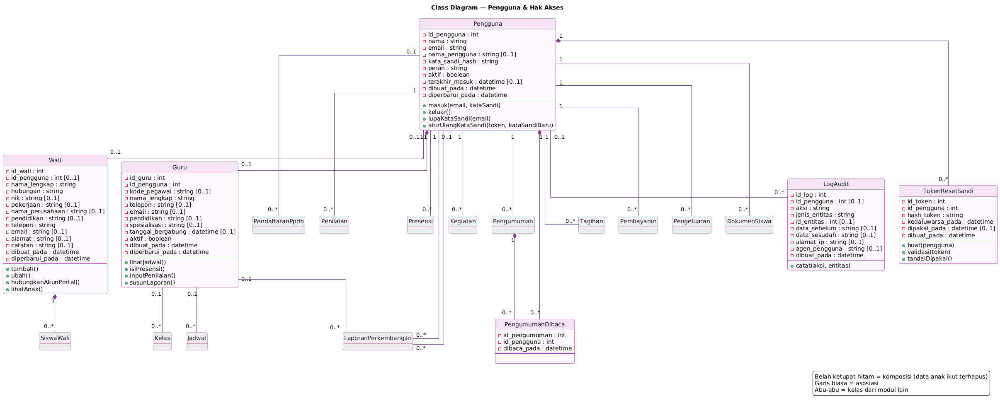

<sub>Sumber: [`diagram/src/class-pengguna.puml`](diagram/src/class-pengguna.puml) · Vektor: [`diagram/svg/class-pengguna.svg`](diagram/svg/class-pengguna.svg)</sub>

#### Class diagram — Kesiswaan & Akademik

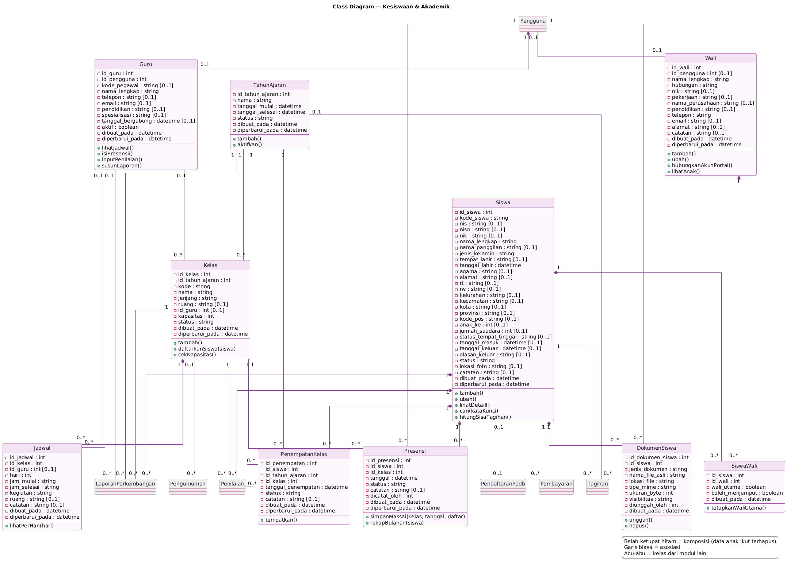

<sub>Sumber: [`diagram/src/class-akademik.puml`](diagram/src/class-akademik.puml) · Vektor: [`diagram/svg/class-akademik.svg`](diagram/svg/class-akademik.svg)</sub>

#### Class diagram — PPDB

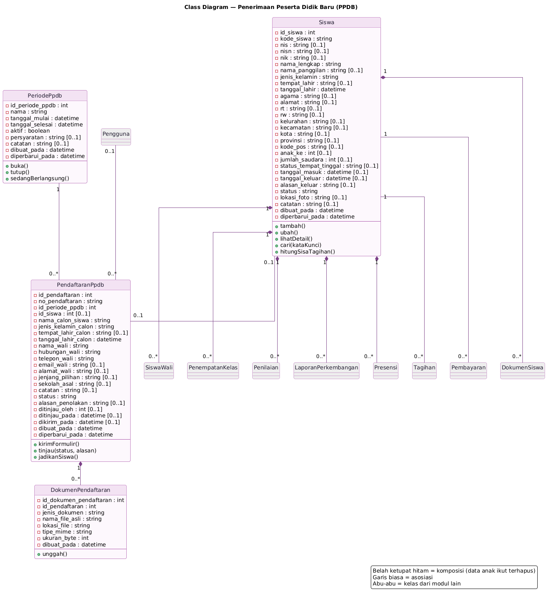

<sub>Sumber: [`diagram/src/class-ppdb.puml`](diagram/src/class-ppdb.puml) · Vektor: [`diagram/svg/class-ppdb.svg`](diagram/svg/class-ppdb.svg)</sub>

#### Class diagram — Penilaian & Laporan

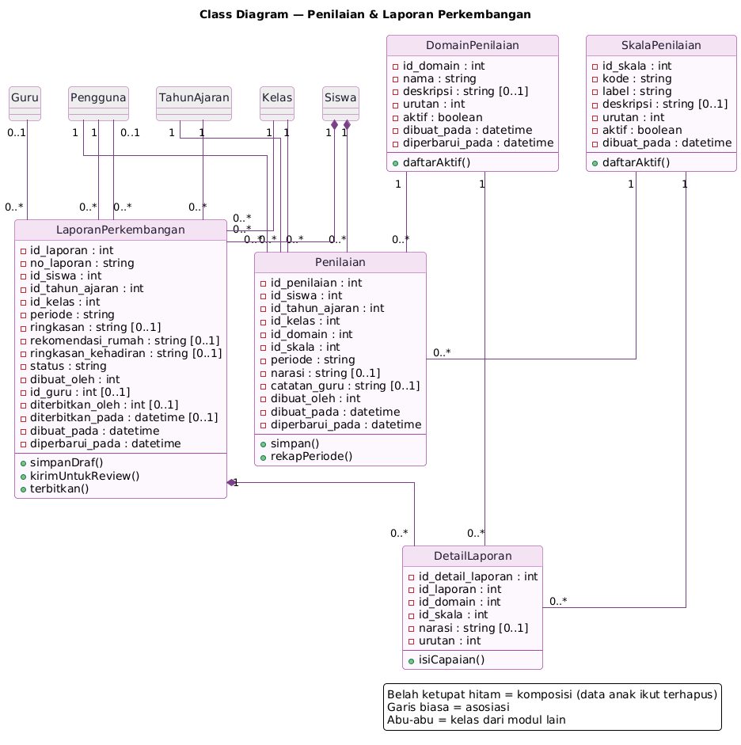

<sub>Sumber: [`diagram/src/class-penilaian.puml`](diagram/src/class-penilaian.puml) · Vektor: [`diagram/svg/class-penilaian.svg`](diagram/svg/class-penilaian.svg)</sub>

#### Class diagram — Keuangan

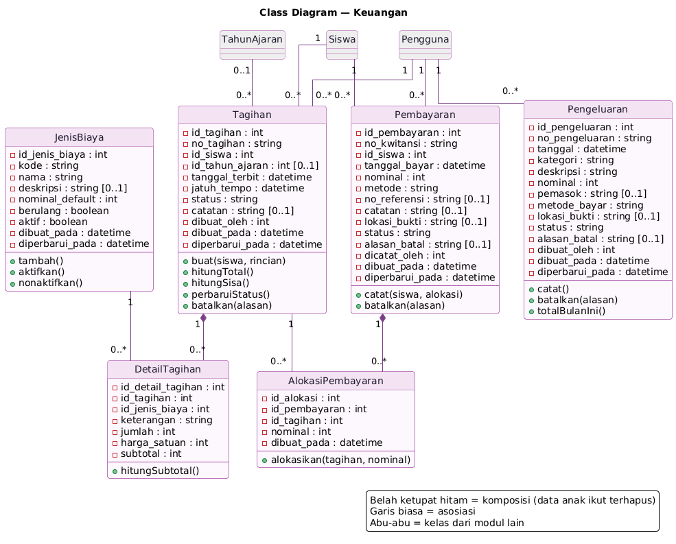

<sub>Sumber: [`diagram/src/class-keuangan.puml`](diagram/src/class-keuangan.puml) · Vektor: [`diagram/svg/class-keuangan.svg`](diagram/svg/class-keuangan.svg)</sub>

#### Class diagram — Informasi & Website

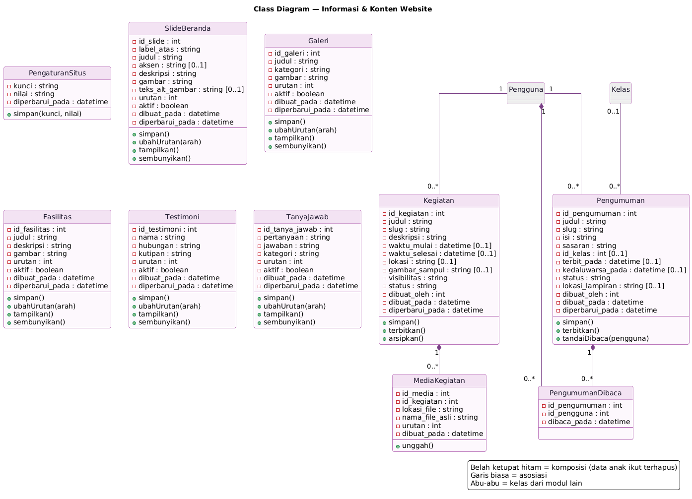

<sub>Sumber: [`diagram/src/class-informasi.puml`](diagram/src/class-informasi.puml) · Vektor: [`diagram/svg/class-informasi.svg`](diagram/svg/class-informasi.svg)</sub>

### 8. Diagram UML lainnya

#### Object diagram — contoh data satu siswa

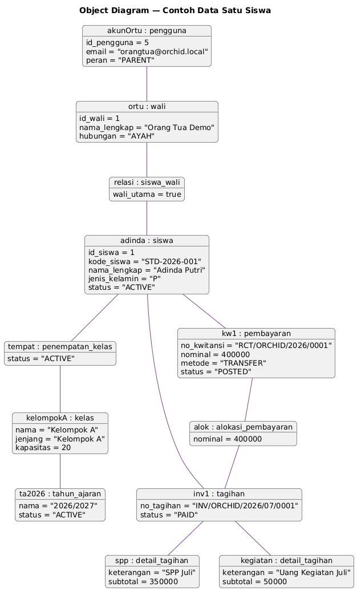

<sub>Sumber: [`diagram/src/object.puml`](diagram/src/object.puml) · Vektor: [`diagram/svg/object.svg`](diagram/svg/object.svg)</sub>

#### Package diagram — struktur kode sumber

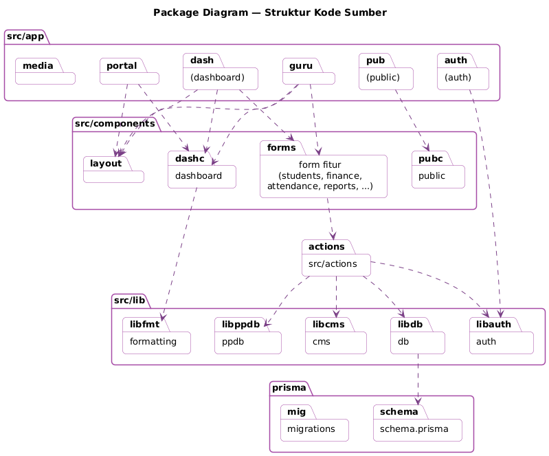

<sub>Sumber: [`diagram/src/package.puml`](diagram/src/package.puml) · Vektor: [`diagram/svg/package.svg`](diagram/svg/package.svg)</sub>

#### Component diagram — arsitektur aplikasi

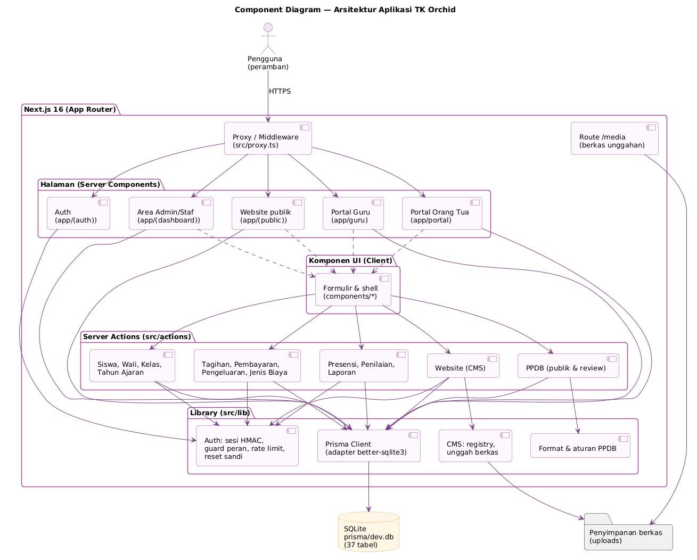

<sub>Sumber: [`diagram/src/component.puml`](diagram/src/component.puml) · Vektor: [`diagram/svg/component.svg`](diagram/svg/component.svg)</sub>

#### Deployment diagram

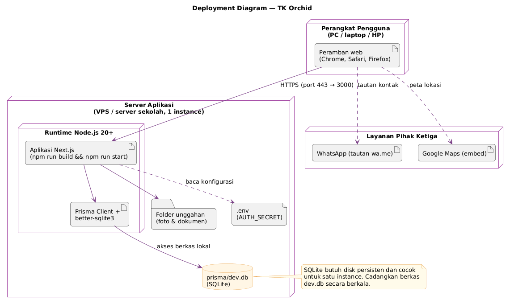

<sub>Sumber: [`diagram/src/deployment.puml`](diagram/src/deployment.puml) · Vektor: [`diagram/svg/deployment.svg`](diagram/svg/deployment.svg)</sub>

#### Communication diagram — mencatat pembayaran

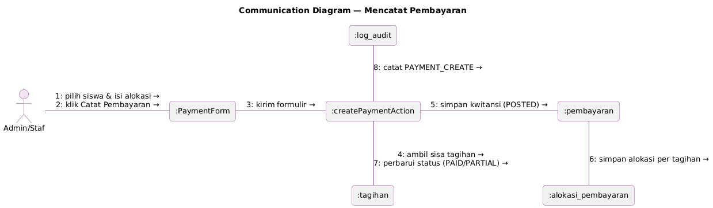

<sub>Sumber: [`diagram/src/communication.puml`](diagram/src/communication.puml) · Vektor: [`diagram/svg/communication.svg`](diagram/svg/communication.svg)</sub>

#### Interaction overview — siklus satu tahun ajaran

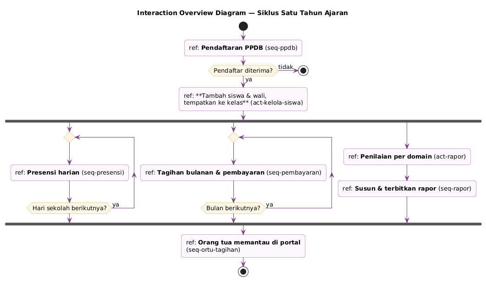

<sub>Sumber: [`diagram/src/interaction-overview.puml`](diagram/src/interaction-overview.puml) · Vektor: [`diagram/svg/interaction-overview.svg`](diagram/svg/interaction-overview.svg)</sub>

#### Timing diagram — contoh perubahan status tagihan

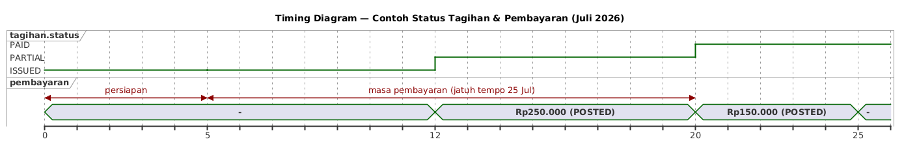

<sub>Sumber: [`diagram/src/timing.puml`](diagram/src/timing.puml) · Vektor: [`diagram/svg/timing.svg`](diagram/svg/timing.svg)</sub>

### 9. Data Flow Diagram (DFD)

#### DFD Level 0 — diagram konteks

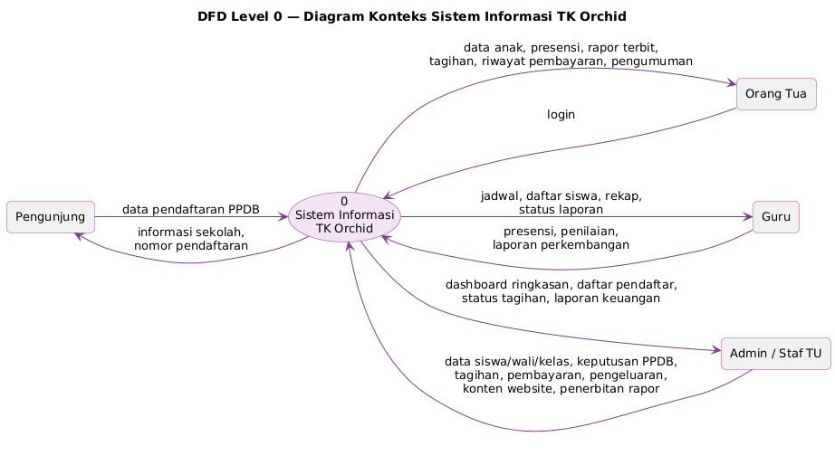

<sub>Sumber: [`diagram/src/dfd-konteks.puml`](diagram/src/dfd-konteks.puml) · Vektor: [`diagram/svg/dfd-konteks.svg`](diagram/svg/dfd-konteks.svg)</sub>

#### DFD Level 1

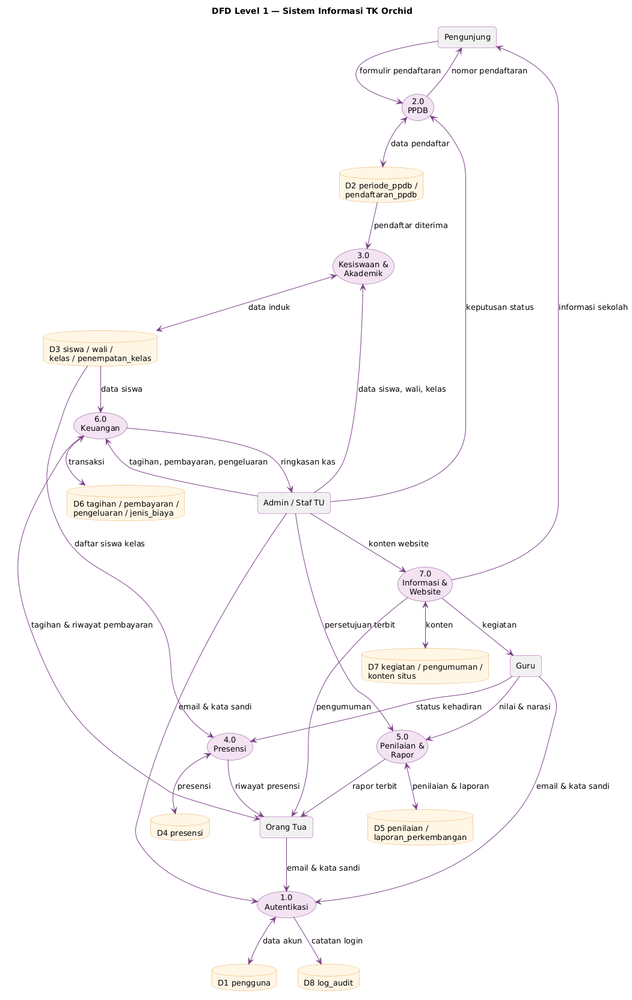

<sub>Sumber: [`diagram/src/dfd-level1.puml`](diagram/src/dfd-level1.puml) · Vektor: [`diagram/svg/dfd-level1.svg`](diagram/svg/dfd-level1.svg)</sub>

### 10. Flowchart

#### Flowchart alur umum sistem per peran

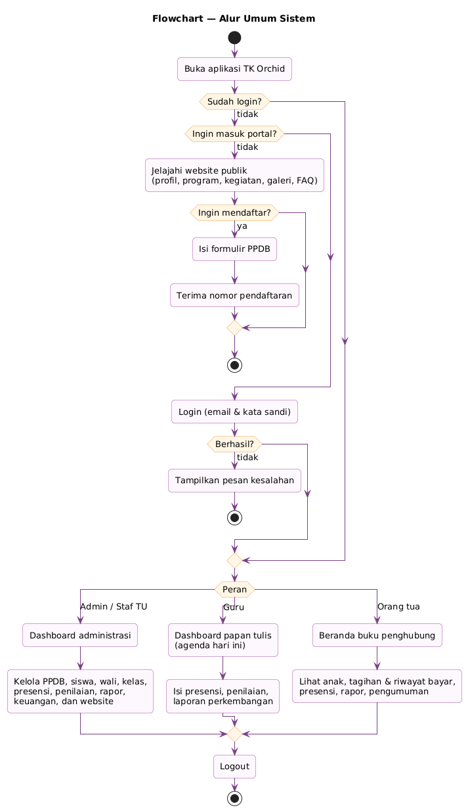

<sub>Sumber: [`diagram/src/flowchart-sistem.puml`](diagram/src/flowchart-sistem.puml) · Vektor: [`diagram/svg/flowchart-sistem.svg`](diagram/svg/flowchart-sistem.svg)</sub>

#### Flowchart perhitungan status tagihan

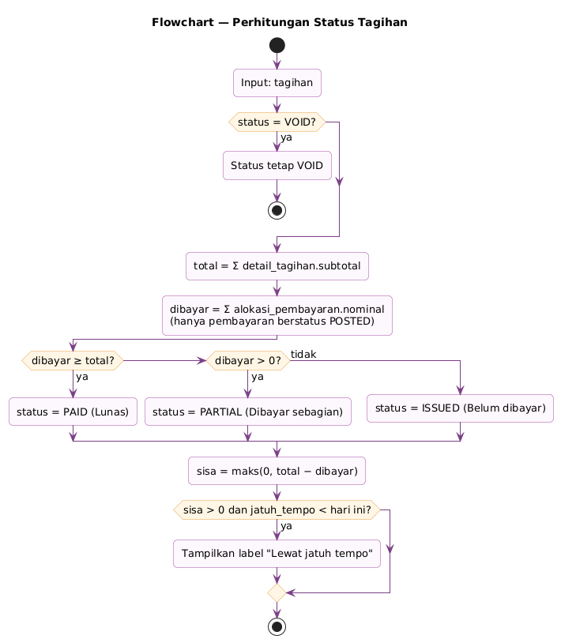

<sub>Sumber: [`diagram/src/flowchart-status-tagihan.puml`](diagram/src/flowchart-status-tagihan.puml) · Vektor: [`diagram/svg/flowchart-status-tagihan.svg`](diagram/svg/flowchart-status-tagihan.svg)</sub>

### 11. Wireframe perancangan antarmuka

Rancangan kasar (*low-fidelity*) form input dan output. Sumber: [`diagram/wireframe/wireframe.html`](diagram/wireframe/wireframe.html) (HTML/CSS); render ulang ke PNG dengan `node docs/diagram/wireframe/render.mjs` (butuh paket `playwright`).

#### Form login

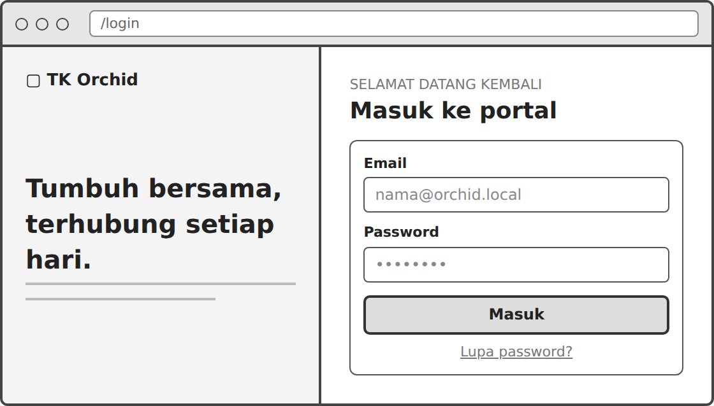

#### Form pendaftaran PPDB


#### Form tambah siswa


#### Form tambah wali


#### Form presensi kelas


#### Form input penilaian


#### Form laporan perkembangan


#### Form buat tagihan


#### Form catat pembayaran


#### Form catat pengeluaran


#### Form konten website


#### Output: dasbor administrasi


#### Output: daftar siswa


#### Output: beranda portal orang tua


#### Output: tagihan & riwayat pembayaran orang tua


#### Output: rapor perkembangan orang tua


### 12. Tahapan pengembangan

#### Alur tahapan pengembangan


<sub>Sumber: [`diagram/src/tahapan-pengembangan.puml`](diagram/src/tahapan-pengembangan.puml) · Vektor: [`diagram/svg/tahapan-pengembangan.svg`](diagram/svg/tahapan-pengembangan.svg)</sub>

#### Jadwal (Gantt chart)


<sub>Sumber: [`diagram/src/gantt-pengembangan.puml`](diagram/src/gantt-pengembangan.puml) · Vektor: [`diagram/svg/gantt-pengembangan.svg`](diagram/svg/gantt-pengembangan.svg)</sub>

#### Alur penanganan laporan masalah (support)


<sub>Sumber: [`diagram/src/alur-support.puml`](diagram/src/alur-support.puml) · Vektor: [`diagram/svg/alur-support.svg`](diagram/svg/alur-support.svg)</sub>

## Laporan Kerja Praktek

- [`laporan/BAB_IV_PEMBAHASAN.docx`](laporan/BAB_IV_PEMBAHASAN.docx) — BAB IV Pembahasan sesuai format Buku Panduan KP Prodi Sistem Informasi (A4, margin 4-4-3-3 cm, Times New Roman 12 pt spasi 1,5), berisi definisi masalah & penyelesaian, use case + skenario, activity, sequence, class diagram, ERD, LRS, spesifikasi tabel, rancangan antarmuka, tampilan layar, serta kelebihan & kekurangan sistem.
- [`laporan/Tahapan_Pengembangan_Sistem.docx`](laporan/Tahapan_Pengembangan_Sistem.docx) — tahapan pengembangan: Gathering Requirements, Blueprint, UT, SIT, UAT, Go Live, Monitoring & Support. Hasil UT dan SIT di dalamnya adalah hasil eksekusi nyata.

## Pengujian

```bash
npm test                 # unit test (Vitest)
node scripts/sit.mjs     # System Integration Test end-to-end (butuh `npm run dev` dan paket playwright; lihat komentar di awal skrip)
git checkout -- prisma/dev.db   # kembalikan data demo setelah SIT
```

## Memperbarui dokumentasi

```bash
npm run docs:generate   # kamus data, ERD, LRS, class diagram dari prisma/schema.prisma
npm run docs:render     # render semua .puml ke PNG & SVG (butuh Java 11+ dan Graphviz)
```

Diagram yang dibuat otomatis (`erd-*`, `lrs`, `class-*`, `kamus-data.md`) jangan diedit manual. Diagram perilaku (use case, activity, sequence, state, DFD, flowchart, dan lainnya) ditulis manual di `diagram/src/`; setelah mengubahnya jalankan `npm run docs:render`.
